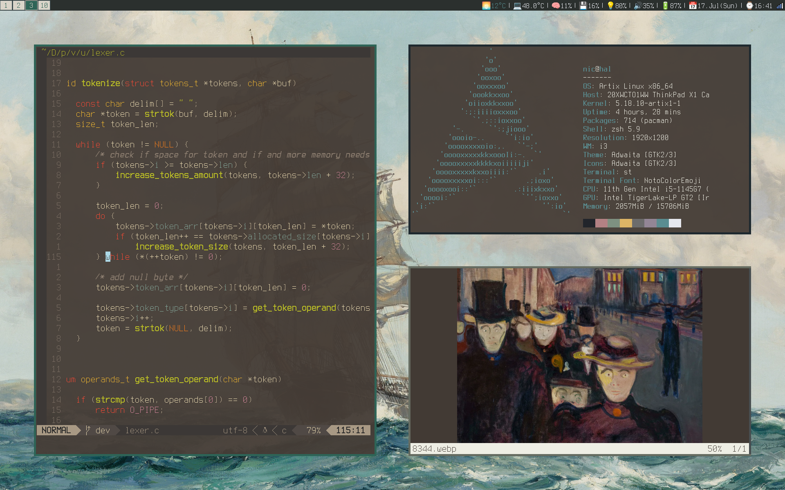

# My dotfiles for Artix Linux (formerly Arch)
- Kernal: Stable (vanilla Linux kernal)
- Display server: Xorg (considering switching to Wayland)
- Window Manager: i3-gaps
- Bar: i3blocks
- Terminal emulator: Simple Terminal with lukesmith.xys' patches
- Shell: zsh as interactive, bash for everything else
- Notification deamon: dunst
- Compositor: picom
- Webrowser: firefox (main), chromium
- Text editor: neovim

## Extra
To get natural scrolling and tapping on touchpad, copy 40-touchpad.conf to /usr/share/X11/xorg.conf.d/40-touchpad.conf.

To get access to Arch repos on Artix, copy pacman.conf to /etc/pacman.conf, and update pacman keyrings.

To get rid of the annoying bell sound on error in xorg, simply remove or rename the file: `# mv /usr/share/sounds/freedesktop/stereo/bell.oga /usr/share/sounds/freedesktop/stereo/bastard.oga` It appears the file is loaded into memory, and so a restart of xorg is required.

To be able to poweroff without a password `# cp nic /etc/sudoers.d/nic`

To be able to change the backlight you can change the file permissions: `# chmod a+rw /sys/class/backlight/intel_backlight/brightness`.

The packages required (+ some more for convenience) to get a system up and running is found in the `packages` file

